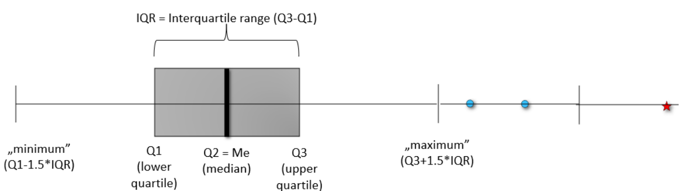

# 1. előadás
## Kombinatorika  
- **Permutáció**: *n* megkülönböztethető elemek rendezett sorozata  
$$P_n = n!$$  
- **Ismétléses permutáció**:  
$$P_n^{k_1, k_2, ..., k_m} = \frac{n!}{k_1! \cdot k_2! \cdot \cdot \cdot k_m!} $$  
- **Variáció**: Adott *n* elem *k* elemű részhalamzának rendezése  
$$V_n^k = \frac{n!}{n-k!} $$  
- **Ismétléses variáció**:  
$$V_n^{k,r} = n^k $$  
- **Kombináció**: Legyen *n* megkülönböztethető elemünk, *k* elemet választunk úgy, hogy minden egyes elem pontosan egyszer választható  
$$C_n^k = \binom{n}{k} = \frac{n!}{(n-k)!}$$  
- **Ismétléses kombináció**:  
$$C_n^{k,r} = \binom{n+k-1}{k}$$  

---
# 2. előadás
## Valószínűségi mező  
- **Definíció**: Egy K kisérlet eredményei, amelyeket nem tudunk felosztani kisebb részekre **elemi eseményeknek** nevezzük. Az elemi eseményeket $\omega$ (kis omega) jelölik. Az összes elemi esemény halmazát **mintatérnek** (valószínűségi térnek) nevezzük. Jelölése: $\Omega$ (nagy omega)

- **Példa**:  
  Érmedobás: $Ω = \{Fej,Írás\}$

---

## Relatív gyakoriság

- **Definíció:** Ha egy kisérletet *n* alkalommal ismétlünk, és $A$ esemény $k_a$ alkalommal fordul elő akkor:  
$$\frac{k_a}{n}$$  
nevezzük **relatív gyakoriságnak**.
- Tegyük fel, hogy egy szabályos kockát feldobunk 60-szor, és megvizsgáljuk, hogy hányszor esett 6-os. Ha a 60 dobás során 6-os 15 alkalommal fordult elő, akkor a 6-os esemény relatív gyakorisága: 
$$\frac{k_a}{n} = \frac{15}{60} = 0.25$$

---

## Eloszlás  
$Ω = \{ω_1,...,ω_N\}$ mintatér esetén a $p_1,...,p_N$ értékeket eloszlásnak nevezünk.  
Például: egy zsákban van 10 golyó, benne van 2 piros, 5 kék, és 3 fehér golyó. Ezeknek az eloszlása így fog kinézni:  
$$p_{piros} = 0.2 \quad p_{kék} = 0.5 \quad p_{fehér} = 0.3$$

### Jellemzői
- $p_i$ számok nem negatívak
- a valószínűségek összege 1
  $$\sum_{i=1}^Np_i = 1$$

---

## Klasszikus valószínűség
- **Definíció:** ha egy kisérlet lehetséges kimenetelei egyenlően valószínűek akkor A esemény valószínűsége:  
$$P(A) = \frac{\text{kedvező esetek száma}} {\text{összes lehetséges eset száma}}$$

- **Például**: Feldobunk egy szabályos dobókockát, mennyi a valószínűsége, hogy párost dobunk?  

  Kedvező esetek száma: $3 (2, 4, 6)$  

  Összes eset száma: $6 (1, 2, 3, 4, 5, 6)$  

  $P(\text{páros}) = \frac{3}{6} = 0.5$

### A valószínűség geometriai kiszámítása

$$P(A) = \frac{\lambda(\text{pont})}{\lambda(\text{összes})}$$  
ahol $\lambda$ a hossz, terület vagy térfogat, ha egyenesen, síkon vagy térben vagyunk.

- **Például**: Adott egy egységhosszú négyzet, benne egy fél egység sugarú kör. Mennyi a valószínűsége hogy véletlenszerűen választva egy pontot a pont a kör belsejébe fog esni?  

  Négyzet területe: $\lambda(\text{összes}) = 1 \cdot 1 = 1$  

  Kör területe: $\lambda(\text{pont}) = \pi r^2 = \pi (\frac{1}{2})^2 = \frac{\pi}{4}$  

  $P(\text{körbe esik}) = \frac{\lambda(\text{pont})}{\lambda(\text{összes})} = \frac{\frac{\pi}{4}}{1} = \frac{\pi}{4} \approx 0.785$

---

## Feltételes valószínűség  
- **Definíció**:  
A feltételes valószínűség megmutatja $A$ valószínűségét, ha $B$ bekövetkezett:  
$$P(A|B) = \frac{P(A \cap B)}{P(B)}$$  
- **Például**: Egy urnában van 3 piros, 2 kék, 5 zöld golyó. Mennyi annak a valószínűsége, hogy a kihúzott golyó piros, ha tudjuk hogy egy zöldet sem húztunk?  

  $$P(B) = P(\text{nem zöld}) = \frac{5}{10}$$  

  $$P(A \cap B) = P(\text{piros és nem zöld}) = P(\text{piros}) = \frac{3}{10}$$

  $$P(A|B) = \frac{P(A \cap B)}{P(B)} = \frac{\frac{3}{10}}{\frac{5}{10}} = \frac{3}{5}$$
---

## Teljes valószínűség tétele  
- **Definíció**: Legyen $B_1, B_2, ...$ teljes eseményrendszer. Ha $P(B_i)>0$ bármely $i$ esetén, akkor $A$:  

$$P(A) = \sum_{i=1}^n P(A|B_i) \cdot P(B_i)$$  
- **Például**: Egy gyárban három gép gyárt termékeket.
  Az első gép a termékek 50%-át gyártja, és a hibás termékek aránya 2%.
  A második gép a termékek 30%-át gyártja, és a hibás termékek aránya 3%.
  A harmadik gép a termékek 20%-át gyártja, és a hibás termékek aránya 5%.
  Mi annak a valószínűsége hogy véletlenszerűen választva hibás terméket húzunk ki?  

  |           | Első gép | Második gép | Harmadik gép |
  |-----------|----------|-------------|--------------|
  |$P(A\|B_i)$| $50\%$   | $30\%$      | $20\%$       |
  |$P(B_i)$   | $2\%$    | $3\%$       | $5\%$        |

  $P(A) = 0.5 \cdot 0.02 + 0.3 \cdot 0.03 + 0.2 \cdot 0.05 = 0.029 = 2.9\%$

---

## Bayes tétel  
**Bayes formula**:  

$$P(B|A) = \frac{P(A|B) \cdot P(B)}{P(A)}$$  
**Bayes tétel**:  

$$P(B_i|A) = \frac{P(A|B_i)P(B_i)}{\sum_{j=1}^\infty P(A|B_j)P(B_j)}$$  

- **Például**: Mennyi a valószínűsége, hogy a második gépből húzzuk ki a terméket, ha tudjuk hogy hibás?
  $$P(B_2|A) = \frac{0.3 \cdot 0.03}{0.029} \approx 0.3103 = 31.03\% $$

---

## Eseményfüggetlenség  
**Definíció**: $A$ esemény független $B$ eseménytől, ha B bekövetkezése nincs hatással $A$ valószínűségére. Azaz:

$$P(A|B) = P(A)$$  
**Definíció**: Azt mondjuk hogy $A$ és $B$ **független**, ha:

$$P(A \cap B) = P(A) \cdot P(B)$$  

### Páronkénti függetlenség
**Definíció**: Azt mondjuk, hogy az $A_1, A_2, ...$ események **páronként** függetlenek, ha közülük bármely kettő független, azaz:

$$P(A_iA_j) = P(A_i)P(A_j), i\not ={j}$$

### Teljes függetlenség
**Definíció**: Azt mondjuk, hogy az $A_1, A_2, ...$ események **teljesen** függetlenek, ha bármely eseményszámra és bármely indexű eseményekre független, azaz:

$$P(A_{i_1}A_{i_2}...A_{i_k}) = P(A_{i_1})P(A_{i_2})...P(A_{i_k})$$

### Például
Egy szabályos hatoldalú dobókockát feldobunk egyszer, és megvizsgáljuk a következő eseményeket:  

$A:\text{a dobott szám páros}$ $(2,4,6)$  

$B:\text{a dobott szám nagyobb, mint 3}$ $(4,5,6)$  

$C:\text{a dobott szám 6}$ $(6)$  

1. Független-e $A$ és $B$?  

   $P(A) = \frac{3}{6} = \frac{1}{2}$  

   $P(B) = \frac{3}{6} = \frac{1}{2}$  

   $P(A \cap B) = \frac{2}{6} = \frac{1}{3}$

   $P(A \cap B) \not = {P(A) \cdot P(B)}$, tehát a két esemény nem független

2. Páronként függetlenek?  
   
   Mivel már $A$ és $B$ sem független, ezért nem teljesül, hogy közülük bármelyik kettő független, szóval nem páronként függetlenek.

3. Teljesen függetlenek?  

   Mivel az események már páronként sem függetlenek, ezért teljes függetlenségük sem áll fenn.

---

# 3. előadás
## Valószínűségi változó
**Definíció**: adott $\Omega$ eseménytér, $\mathcal{F}$ eseményhalmaz. A valószínűségi változó egy olyan függvény, amely az eseményhalmazból leképzést készít a valós számok egy megszámlálható halmazává. $X:\mathcal{F} → D$

---

## Diszkrét valószínűségi változó
**Definíció**: olyan valószínűségi változó, melynek értékkészlete megszámlálható  
Például kockadobás:
$$P(X = 1) = \frac{1}{6}$$  
$$P(X = 2) = \frac{1}{6}$$  
$$P(X = 3) = \frac{1}{6}$$  
$$P(X = 4) = \frac{1}{6}$$  
$$P(X = 5) = \frac{1}{6}$$  
$$P(X = 6) = \frac{1}{6}$$  

---

## Várható érték 

**Definíció**: Egy valószínűségi változó súlyozott átlaga.  

**Képlete**: $\sum_{k=1}^\infty p_kx_k$, ahol $p_k$ a valószínűség, $x_k$ az érték  

**Például**:  Kockadobások várható értéke: $\frac{1}{6}\cdot1+\frac{1}{6}\cdot2+\frac{1}{6}\cdot3+\frac{1}{6}\cdot4+\frac{1}{6}\cdot5+\frac{1}{6}\cdot6 =3.5$  

**Második momentum**: $EX^2 = \sum_{k=1}^\infty p_kx^2_k$  

**Jellemzői**:
  - Lineáris: 
    - $E(X+Y)=EX+EY$
    - $E(cX)=cE(X)$
  - Ha $X$ és $Y$ Független, akkor $E(XY) = E(X) \cdot E(Y)$  

---

## Szórásnégyzet (variancia)  
**Definíció**: A szórásnégyzet, más néven variancia megmutatja, hogy egy valószínűségi változó milyen mértékben szóródik a várható érték körül.  
$$D^2X = \text{Var}(X) = EX^2 - E^2X$$  
**Tulajdonságai**:
  - $\text{Var}(aX+b)=a^2\text{Var}X$

---

## Nevezetes diszkrét eloszlások  

1. **Hipergeometrikus eloszlás**:
   - $X \sim Hyper(N, M, n)$
   - **Jelentése:** Összesen $N$ golyó van a dobozban, benne $M$ piros golyó, $N-M$ fehér golyó. Ki szeretnénk húzni $n$ darabot belőlük **visszatevés nélkül**. 
   - **Képlete:**
   $$h_k = P(X = k) = \frac{\binom{M}{k}\binom{N-M}{n-k}}{\binom{N}{n}}$$
   ahol $k$ a kihúzni kívánt piros golyók száma.
   - **Várható értéke:** $E=\frac{Mn}{N}$

2. **Binomiális eloszlás**:  
   - $X \sim Binom(n, p)$
   - **Jelentése:** Összesen $N$ golyó van a dobozban, benne $M$ piros golyó, $N-M$ fehér golyó. Ki szeretnénk húzni $n$ darabot belőlük **visszatevéssel**. $p = \frac{M}{N}$, vagyis a piros golyók relatív valószínűsége.
   - **Képlete:** 
     $$P(X = k) = \binom{n}{k} p^k (1-p)^{n-k}$$  
   - **Várható értéke:** $E=n \cdot p$

3. **Poisson-eloszlás**:  
   - $X \sim Poisson(\lambda)$
   - **Jelentése:** Akkor használjuk, ha egy adott időintervallumon bekövetkező események számát szeretnénk jellemezni.  
   - **Például**: egy telefonközpontba átlagosan $\lambda=5$ hívás érkezik percenként. Mi annak a valószínűsége, hogy egy adott percben pontosan 3 hívás érkezik?
   - **Képlete**:  
     $$P(X = k) = \frac{\lambda^k e^{-\lambda}}{k!}$$
   - **Várható értéke:** $E=\lambda$

4. **Negatív binomiális eloszlás**:  
   - $X \sim NB(r, p)$
   - **Jelentése**: Addig figyeljük a sorozatot, amíg $r$ siker nem következik be. Egy siker valószínűsége $p$.
   - **Például**: Addig dobunk dobókockával, amíg 2 darab 6-ost nem dobunk. Itt $p=1/6, r=2$.
     - **Részesete**: Ha $r=1$, akkor **geometrikus eloszlás**ról beszélünk
     - **Képlete**: $P(X = 1+k) = p(1-p)^k$
   - **Várható értéke:** $E=\frac{r}{p}$

---

## Poisson eloszlás várható értékének levezetése (5-ért)

1. Felírjuk a várható érték képletét a Poisson eloszlásra  
   $$EX = \sum_{k=0}^\infty k\cdot\frac{\lambda^k}{k!}e^{-\lambda}$$  
   
2. $k = 0$ szorzó elhagyható, lehet egyszerűsíteni a $k$-val, tehát:  
   $$EX = \sum_{k=1}^\infty\frac{\lambda^k}{(k-1)!}e^{-\lambda}$$  

3. $k-1$ helyére írjunk $l$-t, tehát:
   $$EX = \sum_{l=0}^\infty\frac{\lambda^{l+1}}{l!}e^{-\lambda}$$  

4. Kiemelünk egy $\lambda$-t a számlálóból, kihozzuk a szumma elé, és kiemeljük az $e^{-\lambda}$  
   $$EX = \lambda e^{-\lambda} \sum_{l=0}^\infty\frac{\lambda^{l}}{l!}$$  

5. $\sum_{l=0}^\infty\frac{\lambda^{l}}{l!} = e^\lambda$ Taylor-sort felhasználva, ebből következik  
   $$EX = \lambda e^{-\lambda} e^\lambda$$
6. $e^\lambda \cdot \frac{1}{e^\lambda} = 1$, tehát:  

   $$EX = \lambda$$

---

## Eloszlásfüggvény  
**Definíció**: Megadja, hogy a valószínűségi változó egy adott értékig bezárólag mekkora valószínűséggel vesz fel értéket. Diszkrét eloszlásfüggvénynél ez egy lépcsős függvény.  
$F_X(x)=P(X<x)$

### Diszkrét eloszlásfüggvény tulajdonságai:  
- A függvény monoton növekvő.  
- A függvény bal-folytonos. 
- $\lim_{x→\infty}F(x) = 1, \lim_{x→-\infty}F(x) = 0$ 

### Például
Egy érme feldobásánál az eloszlásfüggvény:
$F_x(x) = 0 \text{ a } x < 0 \text{ tartományban }$  
$F_x(x) = \frac{1}{2} \text{ a } 0 \leq x < 1 \text{ tartományban }$  
$F_x(x) = 1 \text{ a } x \geq 0 \text{ tartományban }$  

---

# 4. előadás
## Abszolút folytonos eloszlásfüggvény tulajdonságai  
$F(b)-F(a)$: Az érték [a, b] intervallumba esésének valószínűsége.  

**Például**: a normális eloszlást felhasználva:  

$$P(-1 \leq X \leq 1) = F_x(1) - F_x(-1)$$

---

## Sűrűségfüggvény  
**Definíció**: Deriváltja az eloszlásfüggvénynek:  
Legyen $f$ a sűrűségfüggvény, $F$ az eloszlásfüggvény  

$$f(x) = F'(x)$$  

$$F(x) = \int_{-\infty}^xf(x)dx$$  

**Tulajdonságai:**
  - $\lim_{x→-\infty}f(x) = 0$
  - $\lim_{x→\infty}f(x) = 1$
  - $\int_{-\infty}^\infty f(x)dx = 1$  

---

## Várható érték
Itt nem alkalmazható a diszkrét várható érték képletet, mert megszámláhatatlan sok valószínűségi változó van.  

**Képlete:**  

$$EX = \int_{-\infty}^{+\infty} xf(x)dx$$  

**Tulajdonságai:**
  - Lineáris
  - Ha $X\geq 0$, akkor $EX\geq 0$ (ha egy valószínűségi változó $X$ nem negatív, akkor a várható értéke is nem negatív lesz.)
  - Ha $X\geq Y$, akkor $EX\geq EY$ (ha $X$ minden egyes kimenetele nagyobb vagy egyenlő, mint $Y$ megfelelő kimenetele, akkor az $X$ várható értéke is nagyobb vagy egyenlő lesz, mint $Y$ várható értéke.)
  - Ha $X\geq 0$ és $EX = 0$, akkor $P(X=0)=1$ (ha egy nem negatív valószínűségi változó várható értéke 0, akkor az esemény, hogy $X=0$, teljes valószínűséggel megtörténik)

---

## Nagy számok törvénye  
**Definíció**: Egy minta átlaga nagy mintaszám esetén közelít a várható értékhez.
**Például**: Tegyük fel, hogy egy érmét dobunk. Ha csak 5 alkalommal dobsz érmét, előfordulhat, hogy 4-szer fej és 1-szer írás lesz. Ha 1,000, 10,000 vagy több alkalommal dobod az érmét, az átlag egyre inkább közelíteni fog a 0.5-höz.

---

## Nevezetes abszolút folytonos eloszlások
  1. **Egyenletes eloszlás**  
     
       
     - **Eloszlásfüggvény**:  
        
     - **Sűrűségfüggvény**:  
        
     - **Várható érték**:  
       $$E(X) = \frac{a+b}{2}$$  
     - **Szórásnégyzet**:  
       $$\text{Var}(X) = \frac{(b-a)^2}{12}$$  
  2. **Normális eloszlás**  
     
     
     - **Sűrűségfüggvény (csak 5ért)**  
       $$f(x) = \frac{1}{\sqrt{2\pi\sigma^2}} e^{-\frac{(x-\mu)^2}{2\sigma^2}}$$
       ahol $\sigma$ a szórás, $\mu$ pedig a várható érték
     - **Standardizálás**  
     **Definíció:** Mivel minden normális eloszlás a standard normális egy transzformáltjával egyenlő, bármely x pont átalakítható egy vele azonos standard normális-beli z ponttá.
     $$z = \frac{x-\mu}{\sigma}$$

## Központi határeloszlás tétele
**Definició:** egy elég nagy mintaméretű független és azonos eloszlású valószínűségi változók összege (vagy átlag) közelítőleg normális eloszlást követ, még akkor is, ha az eredeti változók eloszlása nem normális.

# 5. előadás

## Kontingencia táblázat  

- **Definíció**: Többváltozós adatok elemzésére használt tábla, amely sorokban és oszlopokban gyakoriságokat vagy relatív gyakoriságokat mutat.  

- **Marginalis (peremeloszlások)**:  
  A sorok és oszlopok összegzett értékei, amelyek az egyes változók eloszlását adják.  

### Példa:  
|        | $y_1$    | $y_2$    | $y_3$   | ... | $\sum$   |
|--------|----------|----------|---------|-----|----------|
| $x_1$  | $p_{11}$ | $p_{12}$ | $p_{13}$| ... | $p_{1.}$ |
| $x_2$  | $p_{21}$ | $p_{22}$ | $p_{23}$| ... | $p_{2.}$ |
| $x_3$  | $p_{31}$ | $p_{32}$ | $p_{33}$| ... | $p_{3.}$ |
|  ...   | ...      | ...      | ...     | ... | ...      |
| $\sum$ | $p_{.1}$ | $p_{.2}$ | $p_{.3}$| ... | 1        |

ahol, $p_{i.}$ és $p_{.j}$ marginális eloszlások.  
$$p_{i.} = P(X = x_i) = \sum_{j=1}^\infty p_{ij}$$  
$$p_{.j} = P(X = x_i) = \sum_{i=1}^\infty p_{ij}$$  
$$\sum_{i=1}^\infty \sum_{j=1}^\infty p_{ij} = 1$$  

- **Függetlenség:** Két változó független, ha az együttes eloszlásuk a peremeloszlások szorzataként írható fel:    
  
  $$p_{ij} = p_{i.}p_{.j}$$  
---

## Együttes eloszlásfüggvény  
**Definíció**: Ez a függvény azt mutatja meg, hogy a két változó együttesen milyen valószínűséggel esik egy adott tartományba. Az együttes eloszlásfüggvény segít megérteni a két változó közötti kapcsolatot és azok együttes eloszlását. Két változó $X$ és $Y$ együttes eloszlása: $F(x, y)$

- Tulajdonságok:  
  - Monoton növekvő mindkét változó szerint.  

  - X eloszlásfüggvénye: $F_X(x) = \lim_{y→\infty} F(x,y)$  
  - Y eloszlásfüggvénye: $F_Y(y) = \lim_{x→\infty} F(x,y)$
    

---

## Együttes sűrűségfüggvény  
**Definíció**: két vagy több valószínűségi változó közös sűrűségi függvénye. Két valószínűségi változó $X$ és $Y$ esetén az együttes sűrűségfüggvény 
$f_{X,Y}(x,y)$ megadja a valószínűségi változók együttes sűrűségét egy adott $(x,y)$ pontban. Ez a függvény az egyes változók együttes eloszlásának sűrűségét írja le, és segít meghatározni, hogy két valószínűségi változó hogyan viszonyul egymáshoz egy adott tartományban.

---

## Kovariancia  
**Definíció**: Két változó közötti lineáris kapcsolat mértéke.  

$$cov(X,Y) = E(XY)-EX \cdot EY$$

---

## Korreláció  
- **Definíció**: A kovariancia és a szórások hányadosa, amely normált mértékét adja a lineáris kapcsolatnak.  

$$corr(X, Y) = \frac{cov(X,Y)}{DX DY} $$

- **Lineáris erősség**:
  A korrelációs együttható lényege abban rejlik, hogy segít megérteni, milyen erősen és milyen irányban kapcsolódik két valószínűségi változó, és milyen típusú kapcsolat áll fenn közöttük.  

  $$-1 \leq corr(\xi(\text{xi}), \eta(\text{éta})) \leq 1$$  

  Ha $corr(\xi, \eta) = 1$, akkor pozitív lineáris kapcsolat van közöttük (egyik nő, másik is nő)  

  Ha $corr(\xi, \eta) = -1$, akkor negatív lineáris kapcsolat van közöttük (egyik nő, másik csökken)  

  Ha $corr(\xi, \eta) = 0$, akkor nincs kapcsolat a két változó között

# 7. előadás

## Mintavételi módszerek  
- **Egyszerű véletlen mintavétel**
  - **Definíció**: Egyszerű véletlen mintavétel esetén az alapsokaság minden egyede
  egyforma eséllyel kerül a mintába, azaz a minta leírható független, azonos
  eloszlású (FAE) változók sorozataként. A mintavétel lehet visszatevéses
  vagy visszatevés nélküli.  
  - **Például**: egy vállalat szeretne 10 alkalmazottat kiválasztani egy tréningprogramra egy 50 fős munkahelyi csoportról. Az alkalmazottakat véletlenszerűen választják ki, így minden egyes alkalmazott egyforma eséllyel kerülhet a mintába, függetlenül attól, hogy melyik alkalmazottat választották már ki.
- **Rétegzett mintavétel**
  - **Definíció**: Ha az alapsokaságot valamilyen szempont (nem, kor stb.) szerint részekre bontjuk, és ezekből az ún. rétegekből egymástól függetlenül veszünk egyszerű véletlen mintákat, akkor rétegzett mintavételről beszélünk.
  - **Például**: egy egyetem szeretne véleményt kérni a hallgatóktól egy új tantárgy bevezetéséről. Az egyetem alapsokasága különböző karokból áll: jogi kar, orvosi kar és gazdaságtudományi kar. A mintavételt úgy végzik, hogy először rétegekre bontják a hallgatókat karok szerint, majd minden karból végeznek egyszerű véletlen mintavételt.

---

## Minta
- **Definíció**: A minta a statisztikában egy véletlenszerűen kiválasztott adatcsoportot jelent, amely egy alapsokaságot reprezentál. A minta egy konkrét példája, amelyet a gyakorlatban mérünk vagy megfigyelünk.

---

## Empirikus eloszlásfüggvény
- **Definíció**: AAz empirikus eloszlásfüggvény a minta kumulatív gyakoriságát írja le, ami azt jelenti, hogy az empirikus eloszlásfüggvény a minta adatai alapján mutatja meg, hogy az egyes értékekhez tartozó valószínűségek hogyan halmozódnak fel.  

  

- **Például**: Tegyük fel hogy a minta adatai a következőek:  

  

  Ha $x \leq 2$ akkor $F_n^*(x) = 0$,  

  Ha $2 < x \leq 4$ akkor $F_n^*(x) = \frac{1}{5}$,  

  Ha $4 < x \leq 6$ akkor $F_n^*(x) = \frac{2}{5}$,  

  Ha $6 < x \leq 8$ akkor $F_n^*(x) = \frac{3}{5}$,  

  Ha $8 < x \leq 10$ akkor $F_n^*(x) = \frac{4}{5}$,  

  Ha $x > 10$ akkor $F_n^*(x) = 1$  

- A **P(X < t)** kifejezés azt jelenti, hogy az $x$ valószínűségi változó kisebb, mint $t$, és az empirikus eloszlásfüggvény segítségével kiszámolhatjuk a mintában az összes olyan érték arányát, amely kisebb, mint $t$. Az empirikus eloszlásfüggvény $F_n^*(t)$ konkrétan megadja a valószínűséget, hogy a mintában szereplő értékek közül hány érték kisebb vagy egyenlő, mint $t$.

---

## Hisztogram   
- **Gyakorisági hisztogram**: A mintában előforduló értékek gyakoriságát ábrázolja.  
- **Sűrűségi hisztogram**: A mintabeli gyakoriságokat a csoport szélességével normalizálja, így területe 1.  

---

## Mintátlag és várható érték  
- **Mintátlag**:  
  $$\bar{X} = \frac{1}{n}(X_1+X_2+...+X_n)$$
- **Tulajdonság**: A mintaátlag torzítatlan és konzisztens becslése a populáció várható értékének. Vagyis a mintaméret $n$ növelésével a mintátlag közelít a várható értékhez $EX$.  

---

## Empirikus szórásnégyzet  
- **Képlet**:  
  $$s_n^2 = \frac{1}{n} \sum_{i=1}^n (X_i - \bar{X})^2$$  

- **Korrigált empirikus szórásnégyzet képlete:**
  $$s_n^{*2} = \frac{1}{n-1} \sum_{i=1}^n (X_i - \bar{X})^2$$  
  A korrigált empirikus szórásnégyzet torzítatlan és konzisztens becslése a
populáció szórásnégyzetének.
---

## Medián, Kvantilis, Kvartilis  
- **Medián**: Az az érték, amelynél a minta fele kisebb, fele nagyobb (osztópont).  
  $$P(X<\mu)<1/2 \qquad \text{és} \qquad P(X>\mu)\leq1/2$$  
  $\mu$ - medián
- **Kvantilis**: Az $q$-adik kvantilis az az érték, amelynél a megfigyelések $q$-ad része kisebb vagy egyenlő.  
  $$P(X < Q(q)) < q \qquad \text{ha} \qquad P(X > Q(q)) \leq 1-q$$  
  ahol $Q(q)$ a q-adik kvantilis, azaz az az érték, amelyhez tartozik az a valószínűség, hogy $X$ kisebb vagy egyenlő, mint $Q(q)$  

- **Kvartilisok**: 
  - Az alsó kvaritlis a 0.25-kvantilis $(Q_1)$  
  - A felső kvartilis a 0.75-kvantilis $(Q_3)$  

---

## Dobozábra  
**Összetevői**:  
1. Minimum.  
2. Alsó kvartilis $Q_1$.  
3. Medián $Q_2$.  
4. Felső kvartilis $Q_3$.  
5. Maximum.  
6. Szélsőséges értékek (outlierek), ha vannak.  

---

## Maximum Likelihood  
- A Maximum Likelihood becslés lényege, hogy egy adott valószínűségi eloszlás paramétereit úgy becsüljük meg, hogy maximalizáljuk a minta megfigyeléseinek valószínűségét. Más szóval, a cél az, hogy olyan paramétereket találjunk, amelyek a legnagyobb valószínűséget biztosítják a minta előfordulására.  
- **Például:** Ha egy mintát szeretnénk modellálni egy normál eloszlással, akkor a normál eloszlás paraméterei ($\mu, \sigma$) a minta átlaga és szórása lesznek a Maximum Likelihood becslés alapján, mivel ezek azok a paraméterek, amelyek a legnagyobb valószínűséggel magyarázzák a megfigyelt adatokat.

---

# 8. előadás
### Z-próba  
**Definíció**: Olyan statisztikai próba, amelyet általában nagy minták esetén alkalmazunk, amikor a populáció szórásnégyzete ismert.  

- **Próbastatisztika**:  
  $$Z = \frac{\bar{X} - \mu_0}{\sigma / \sqrt{n}}$$  
  ahol:  
  - \( \bar{X} \): mintátlag,  
  - \( \mu_0 \): nullhipotézis szerinti várható érték,  
  - \( \sigma \): ismert populáció szórása,  
  - \( n \): minta nagysága.  

- **Döntési szabály**:  
  Ha \( |Z| > Z_\text{kritikus} \), elutasítjuk a nullhipotézist.  

---

### T-próba  
**Definíció**: A t-próbát akkor használjuk, ha a populáció szórása nem ismert, és a minta kicsi (\(n < 30\)).  

- **Próbastatisztika**:  
  $$T = \frac{\bar{X} - \mu_0}{S / \sqrt{n}}$$  
  ahol \( S \) a minta szórása.  

- **Egy mintás T-próba**:  
  Vizsgálja, hogy a minta átlaga megegyezik-e egy adott értékkel.  

- **Kétmintás T-próba (nem kell)**.  

- **Döntési szabály**:  
  A kritikus érték alapján hasonlítjuk össze a számított \( T \)-t.  

---

### Illeszkedésvizsgálat  
**Definíció**: Megvizsgálja, hogy egy minta adott eloszlásból származik-e.  

- **Próbastatisztika**:  
  $$\chi^2 = \sum_{i=1}^k \frac{(O_i - E_i)^2}{E_i}$$  
  ahol:  
  - \( O_i \): megfigyelt gyakoriság,  
  - \( E_i \): várható gyakoriság,  
  - \( k \): osztályok száma.  

- **Döntési szabály**:  
  Ha \( \chi^2 > \chi^2_\text{kritikus} \), elutasítjuk a nullhipotézist.  

---

